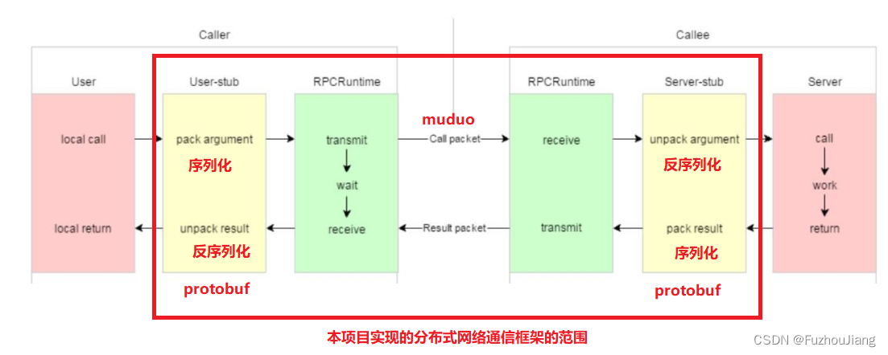
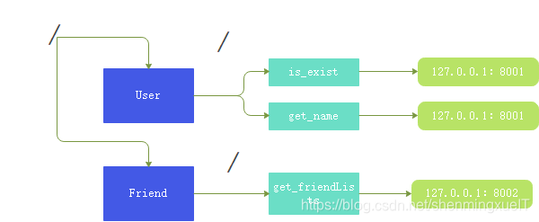
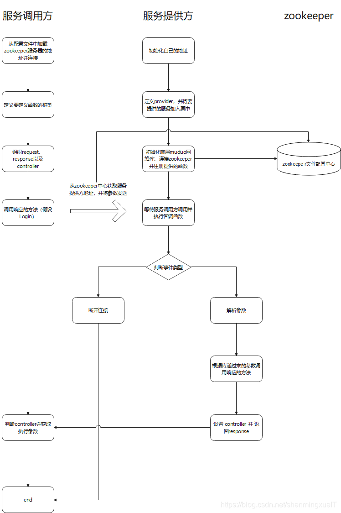

## RPC
RPC的全称是远程过程调用（Remote Procedure Call）

对于一个聊天系统有int send_information(int friend_id,string msg)这个方法, 本机调用如下 :

    调用bool is_exist(int friend_id)判断用户是否在线

    根据结果在决议是发送在线消息还是离线消息

但是如果考虑高并发、高可用以及系统扩展性的话，那我们不得不引入分布式的设计。
这意味这，登录和聊天会部署在不同的机器上！那么要完成上面的逻辑，就不得不依靠网络，
将要调用的函数名以及参数通过网络打包发送给另一个机器，然后由另一台机器将结果发过来。

而我们要做的RPC框架就是为使这个过程更好用而设计的。

## 设计



### protobuf

protobuf 主要是作为整个框架的传输协议。可以看一下整个框架对于传输信息的格式定义：
```proto
message RpcHeader
{
    bytes service_name = 1; 	//类名
    bytes method_name = 2;		//方法名
    uint32 args_size = 3;		//参数大小
}
```

可以看到，它定义了要调用方法是属于哪个类的哪个方法以及这个方法所需要的的参数大小。

那么参数呢？是怎样定义的？

首先我们来看一下我们框架内传输的数据是什么： 4字节标识头部长度+RpcHeader+args

```proto
/*
* 16表示整个类名+方法名+参数长度的大小
	有个这个长度，我们就可以从整个长度中截取UserServiceLogin15这一段
	再根据RpcHeader来反序列话得出类名和方法名以及参数长度三个重要数据
* 15表示后面的参数长度
	由于我们找到了类名和方法名，我们就可以在整个框架存储这些信息的地方得到一个对于这个方法的描述。
	然后借用protobuf的service对象提供的一个接口GetResponsePrototype，并且根据这个方法的描述来反序列化出参数。这个都是根据我们注册的方法的描述来做的。
*/
18UserServiceLogin15zhang san123456
```

### zookeeper

zookeeper 呢在这里其实主要就是起到了一个配置中心的目的

zookeeper上面我们标识了每个类的方法所对应的分布式节点地址，当我们其他服务器想要RPC的时候，就去 zookeeper 上面查询对应要调用的服务在哪个节点上。



    这里就相当于，我其他服务器来 zookeeper 查询User::is_exist ，然后会得到127.0.0.1：8001 这个值，这个值就是你布置这个功能的一个RPC节点的网络标识符，然后向这个节点去发送参数并且等待这个节点的响应。


### 框架使用

使用参考 example


user.proto 定义了RPC方法和方法的请求响应格式
```proto
syntax = "proto3";

package fixbug;

option cc_generic_services = true;

message ResultCode
{
    int32 errcode = 1;
    bytes errmsg = 2;
}

message LoginRequest
{
    bytes name = 1;
    bytes pwd = 2;
}

message LoginResponse
{
    ResultCode result = 1;
    bool success = 2;
}

message RegisterRequst
{
    uint32 id = 1;
    bytes name = 2;
    bytes pwd = 3;
}

message RegisterResponse
{
    ResultCode result = 1;
    bool success = 2;    
}

service UserServiceRpc
{
    rpc Login(LoginRequest) returns(LoginResponse);
    rpc Register(RegisterRequst) returns(RegisterResponse);
}
```

userservice.cpp main函数
```C++
// 框架初始化
MprpcApplication::Init(argc, argv);

// 把 UserService 发布到节点上
RpcProvider provider;
provider.NotifyService(new UserService());

// run 之后进程阻塞，等待远程rpc调用
provider.Run();
```

首先 RPC 框架肯定是部署到一台服务器上的，所以我们需要对这个服务器的 ip 和 port 进行初始化

然后创建一个 porvider（也就是server）对象，将当前 UserService 这个对象传递给他，也就是其实这个 RPC 框架和我们执行具体业务的节点是在同一个服务器上的。RPC框架负责解析其他服务器传递过来的请求，然后将这些参数传递给本地的方法。并将返回值返回给其他服务器。

最后是去让这个 provider 去 run 起来
```C++
// 启动 muduo server
void RpcProvider::Run()
{
    std::string ip = MprpcApplication::GetInstance().GetConfig().Load("rpcserverip");
    uint16_t port = atoi(MprpcApplication::GetInstance().GetConfig().Load("rpcserverport").c_str());
    muduo::net::InetAddress address(ip, port);

    // 创建 TcpServer
    muduo::net::TcpServer server(&m_eventLoop, address, "RpcServer");

    // 绑定事件回调
    server.setConnectionCallback(std::bind(&RpcProvider::OnConnection, this, std::placeholders::_1));
    server.setMessageCallback(std::bind(&RpcProvider::OnMessage, this, std::placeholders::_1, std::placeholders::_2, std::placeholders::_3));

    // 设置server线程数量
    server.setThreadNum(4);

    // 注册到 zk 上， rpcclient可以从zkserver上发现服务
    ZkClient zkcli;
    zkcli.start();
    // 设置service_name为永久节点 method_name为临时节点
    for (auto & sp : m_serviceInfoMap)
    {
        std::string service_path = "/" + sp.first;
        zkcli.create(service_path.c_str(), nullptr, 0);
        for (auto & mp : sp.second.m_methodMap)
        {
            std::string method_path = service_path + "/" + mp.first;
            char method_path_data[128] = {0};
            sprintf(method_path_data, "%s:%d", ip.c_str(), port);
            //ZOO_EPHEMERAL 表示znode时候临时性节点
            zkcli.create(method_path.c_str(), method_path_data, strlen(method_path_data), ZOO_EPHEMERAL);
        }
    }

    // 启动server
    server.start();
    m_eventLoop.loop();
}
```

### 调用服务方

example/caller/calluserservice.cc main函数主要内容

```C++
// 初始化
MprpcApplication::Init(argc, argv);

// 调用远程rpc方法代理类
fixbug::UserServiceRpc_Stub stub(new MpRpcChannel());

// 业务
fixbug::LoginRequest request;
fixbug::LoginResponse response;
request.set_name("zhang san");
request.set_pwd("123456");

fixbug::RegisterRequst reg_request;
fixbug::RegisterResponse reg_response;
reg_request.set_id(999);
reg_request.set_name("li si");
reg_request.set_pwd("666666");

// 通过代理调用方法 同步调用
stub.Login(nullptr, &request, &response, nullptr);

// 调用完成
if (0 == response.result().errcode())
{
    std::cout << "rpc login response : " << response.success() << std::endl;
}
else
{
    std::cout << "rpc login response error : " << response.result().errmsg() << std::endl;
}
```

初始化 RPC 远程调用要连接的服务器

定义一个 UserSeervice 的 stub 桩类，由这个装类去调用Login方法，这个login方法可以去看一下源码的定义：
```C++
class UserService : public fixbug::UserServiceRpc
{
public:
    // 发布RPC服务的机器的本地实际调用
    bool Login(std::string name, std::string pwd)
    {
        std::cout << "doing local login service" << std::endl;
        std::cout << "name : " << name << std::endl;
        return true;
    }

    // 业务负责重写 UserServiceRpc的虚函数，框架负责根据指针调用
    void Login(::google::protobuf::RpcController* controller,
                    const ::fixbug::LoginRequest* request,
                    ::fixbug::LoginResponse* response,
                    ::google::protobuf::Closure* done)
    {
        // 框架直接把请求参数反序列化好，直接可以取出数据做本地业务
        std::string name = request->name();
        std::string pwd = request->pwd();

        // 做本地业务
        bool ret = Login(name, pwd);

        // 响应写入 response 
        fixbug::ResultCode * code = response->mutable_result();
        code->set_errcode(0);
        code->set_errmsg("");
        response->set_success(ret);

        // 回调 框架负责 response 的序列化和网络发送
        done->Run();
    }
};
```

可以看到，Login的 RPC 重载函数有四个参数：controller（表示函数是否出错）、request（请求）、response（响应）、done（响应填写后的回调） 
其主要做的也是去围绕着解析参数，将参数放入本地调用的方法，将结果返回并执行回调函数。至于这个回调函数则是在服务端执行读写事件回调函数绑定的。

绑定的是如下方法：
```C++

// 在RpcProvider::OnMessage中调用
void RpcProvider::OnMessage(const muduo::net::TcpConnectionPtr &conn, 
                            muduo::net::Buffer * buffer, 
                            muduo::Timestamp time)
{
    // 读取头部大小

    // 读取头部原始字符流

    // 反序列化

    // 取出参数

    // 获取service对象和method对象

    // 生成rpc方法的请求request 和 response响应参数

    // 绑定Closure回调
    google::protobuf::Closure * done = 
        google::protobuf::NewCallback<RpcProvider, 
                                  const muduo::net::TcpConnectionPtr &, 
                                  google::protobuf::Message *>
                                  (this, &RpcProvider::SendRpcResponse, 
                                   conn, response);

    // 根据远端rpc请求，调用本地发布的方法
    service->CallMethod(method, nullptr, request, response, done);
}

void RpcProvider::SendRpcResponse(const muduo::net::TcpConnectionPtr & conn, google::protobuf::Message * response)
{
    // 把rpc响应序列化为字符流发送给远程调用方
    std::string response_str;
    if (response->SerializeToString(&response_str))
    {
        // 序列化成功之后把执行结果返回给调用方
        conn->send(response_str);
    }
    else
    {
        std::cout << "response SerializeToString error !!! " << std::endl;
    }
    // 模拟http短链接，发送完服务器主动断开
    conn->shutdown();
}
```

### 桩类是干嘛的

那么其实现在来说，我们并没有看到调用方是何时发送了要调用方法以及相应参数？

我们还是需要去返回桩类，这个是由 protobuf 自动去帮你生成的。

```C++
class UserServiceRpc_Stub : public UserServiceRpc {
 public:
  UserServiceRpc_Stub(::PROTOBUF_NAMESPACE_ID::RpcChannel* channel);
  UserServiceRpc_Stub(::PROTOBUF_NAMESPACE_ID::RpcChannel* channel,
                   ::PROTOBUF_NAMESPACE_ID::Service::ChannelOwnership ownership);
  ~UserServiceRpc_Stub();

  inline ::PROTOBUF_NAMESPACE_ID::RpcChannel* channel() { return channel_; }

  // implements UserServiceRpc ------------------------------------------

  void Login(::PROTOBUF_NAMESPACE_ID::RpcController* controller,
                       const ::fixbug::LoginRequest* request,
                       ::fixbug::LoginResponse* response,
                       ::google::protobuf::Closure* done);
  void Register(::PROTOBUF_NAMESPACE_ID::RpcController* controller,
                       const ::fixbug::RegisterRequst* request,
                       ::fixbug::RegisterResponse* response,
                       ::google::protobuf::Closure* done);
 private:
  ::PROTOBUF_NAMESPACE_ID::RpcChannel* channel_;
  bool owns_channel_;
  GOOGLE_DISALLOW_EVIL_CONSTRUCTORS(UserServiceRpc_Stub);
};

// 我们在定义桩类的时候，会传入一个RpcCannel的指针，这个绑定到这个桩类的channel_指针。 
// 当我们去调用这个桩类的Login方法的时候，会去调用传递进来的channel的CallMethod方法：
void UserServiceRpc_Stub::Login(::PROTOBUF_NAMESPACE_ID::RpcController* controller,
                              const ::fixbug::LoginRequest* request,
                              ::fixbug::LoginResponse* response,
                              ::google::protobuf::Closure* done) {
  channel_->CallMethod(descriptor()->method(0),
                       controller, request, response, done);
}

// 上面走的是RPCChannel的CallMethod
class MpRpcChannel : public google::protobuf::RpcChannel
{
public:
    // 所有使用 stub 代理类调用的rpc方法都走到这里，进行序列化和网络发送
    void CallMethod(const google::protobuf::MethodDescriptor* method,
                          google::protobuf::RpcController* controller, 
                          const google::protobuf::Message* request,
                          google::protobuf::Message* response, 
                          google::protobuf::Closure* done) override;
};

// CallMethod 要干的事情 ： 
// 组织要发送的 request_str 字符串
// 从zookeeper中拿到服务端的 ip 和 port，连接服务端
// 发送 request_str
// 接受服务端返回过来的 response 字符串并反序列化出结果
void MpRpcChannel::CallMethod(const google::protobuf::MethodDescriptor* method,
                        google::protobuf::RpcController* controller, 
                        const google::protobuf::Message* request,
                        google::protobuf::Message* response, 
                        google::protobuf::Closure* done)
{
    const google::protobuf::ServiceDescriptor* service_desc = method->service();
    std::string service_name = service_desc->name();
    std::string method_name = method->name();

    uint32_t args_size = 0;
    std::string args_str;
    if (!request->SerializeToString(&args_str))
    {
        controller->SetFailed("Serialize request args_str error !!!");
        // std::cout << "Serialize request args_str error !!!" << std::endl;
        return;
    }
    args_size = args_str.size();

    // set rpcheader
    mprpc::RpcHeader rpcheader;
    rpcheader.set_service_name(service_name);
    rpcheader.set_method_name(method_name);
    rpcheader.set_args_size(args_size);

    // 序列化 rpcheader
    std::string rpcheader_str;
    if (!rpcheader.SerializeToString(&rpcheader_str))
    {
        controller->SetFailed("Serialize request rpcheader error !!!");
        // std::cout << "Serialize request rpcheader error !!!" << std::endl;
        return;
    }
    uint32_t rpcheader_size = rpcheader_str.size();

    // 组装 rpc 请求帧
    std::string rpc_send_str;
    // rpcheader_size
    rpc_send_str.insert(0, std::string((char*)&rpcheader_size, 4));
    // rpcheader
    rpc_send_str += rpcheader_str;
    // args
    rpc_send_str += args_str;

    // 已经打包好序列化字符流 开始通过网络发送
    int clientfd = socket(AF_INET, SOCK_STREAM, 0);
    if (-1 == clientfd) 
    {
        controller->SetFailed("error create socket : " + std::to_string(errno));
        return;
    }

    // 现在从zkserver上读取rpc方法对应的主机
    ZkClient zkcli;
    zkcli.start();
    std::string method_path = "/" + service_name + "/" + method_name;
    std::string host_data = zkcli.GetData(method_path.c_str());
    if ("" == host_data)
    {
        controller->SetFailed(method_path + " is not exist");
        return;
    }
    int idx = host_data.find(":");
    if (-1 == idx)
    {
        controller->SetFailed(method_path + " address is invalid");
        return;
    }
    std::string ip = host_data.substr(0, idx);
    uint16_t port = atoi(host_data.substr(idx+1, host_data.size() - idx - 1).c_str());

    LOG_INFO("%s:%s:remote: %s, %d", service_name.c_str(), method_name.c_str(), ip.c_str(), port);

    struct sockaddr_in server_addr;
    server_addr.sin_family = AF_INET;
    server_addr.sin_port = htons(port);
    server_addr.sin_addr.s_addr = inet_addr(ip.c_str());

    // 连接
    if (-1 == connect(clientfd, (sockaddr*)&server_addr, sizeof(server_addr)))
    {
        controller->SetFailed("connect error : " + std::to_string(errno));
        // std::cout << "connect error : " << errno << std::endl;
        close(clientfd);
        // exit(EXIT_FAILURE);
        return;
    }

    // 发送
    if (-1 == send(clientfd, rpc_send_str.c_str(), rpc_send_str.size(), 0))
    {
        controller->SetFailed("send error : " + std::to_string(errno));
        close(clientfd);
        return;       
    }

    // 接收响应
    char recv_buf[1024] = {0};
    uint32_t recv_size = 0;
    if (-1 == (recv_size = recv(clientfd, recv_buf, 1024, 0)))
    {
        controller->SetFailed("recv error : " + std::to_string(errno));
        close(clientfd);
        return;
    }

    // 反序列化 response
    if (!response->ParseFromArray(recv_buf, recv_size))
    {
        controller->SetFailed("parse response error !!!");
        close(clientfd);
        return;
    }

    close(clientfd);
}
```

## 总流程
